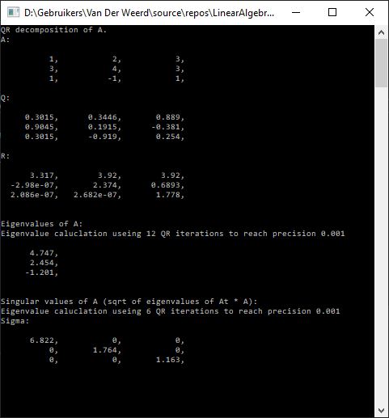

# LinearAlgebra (Work-in-Progress)
Own implementation of Matrix class and LinAlg algos, dev while following Gilbert Strang's 18.06 / 18.065

Implemented so far:
* Basic Matrix & Vector operations
* LU decomposition
* QR decomposition
* Eigenvalue calculation using QR iteration (no Hessenberg reduction / shifts yet)

Working on:
* Inverse (Gauss/Jordan)
* Krylov/GMRES for Ax=b
* Eigenvectors
* Diagonalization
* Full SVD
* Pseudoinverse
* Vector & Matrix norms
* ...

Some examples:



Interface & free functions semantics for LinA class:
```cpp
  LinA::Matrix A(" 1 2 3 ; 3 4 3 ; 1 -1 1 ");
  auto g = QR(A);
  std::cout << "QR decomposition of A.\n";
  std::cout << "A: \n" << A;
  std::cout << "Q: \n" << g.first;
  std::cout << "R: \n" << g.second;
  auto e = Eig(A,1e-3);
```
