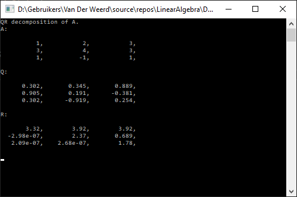

# LinearAlgebra (Work-in-Progress)
Own implementation of Matrix class and LinAlg algos, dev while following Gilbert Strang's 18.06 / 18.065

Implemented so far:
* Basic Matrix & Vector operations
* LU decomposition
* QR decomposition

Working on:
* Eigenvalue calculation using QR iteration with shifts
* SVD

